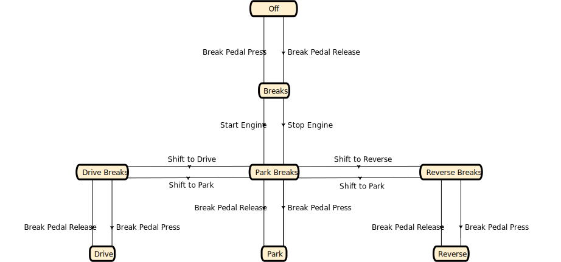

Car Transducer Example{title}

[Source code](https://github.com/SAKryukov/generic-state-machine/tree/main/code/Tests/Test.Transducer.Car)

The Car Transducer Example is a comprehensive example demonstrating [Acceptor](index.html#heading-class-acceptor)
and [Transducer](index.html#heading-class-transducer) features on a highly simplified model of a car with automatic transmission,
keyless entry, only three gearbox positions, and lights.

State diagram:

In fact, the real state set is doubled: every state shown on the diagram comes with its "+Lights" counterpart.

@include(extensible-markdown.md)
